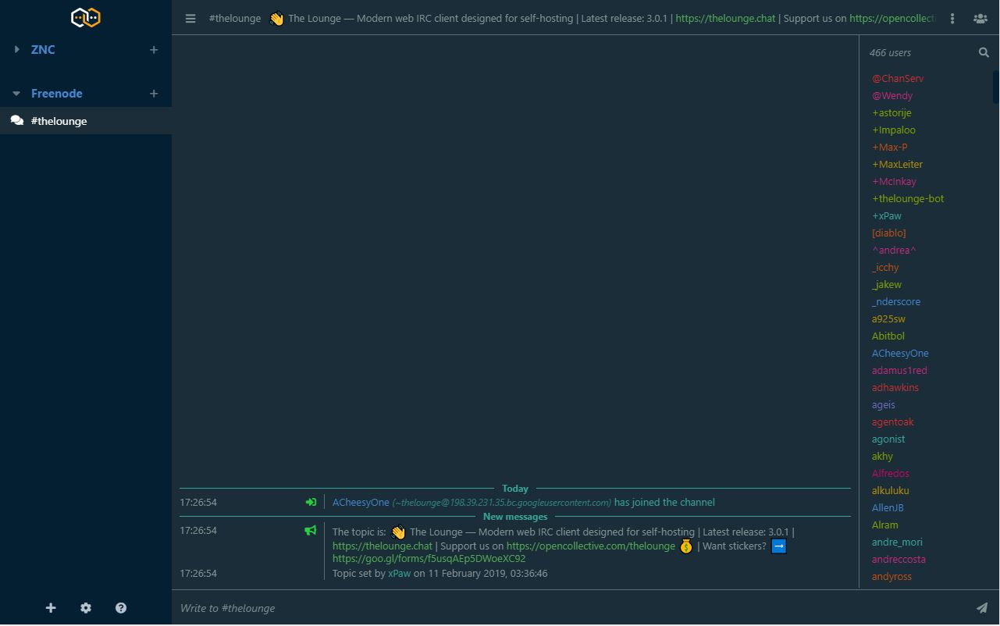

<h1 align="center">
	Hexified theme for The Lounge 
</h1>

[](https://www.npmjs.com/package/thelounge-theme-hexified) [](https://www.npmjs.com/package/thelounge-theme-hexified) [](https://github.com/pattems/thelounge-theme-hexified/blob/master/LICENSE)

<h3 align="center">
	Another Solarized Option
</h3>




## Installation

Install this theme with:

```sh
thelounge install thelounge-theme-hexified
```